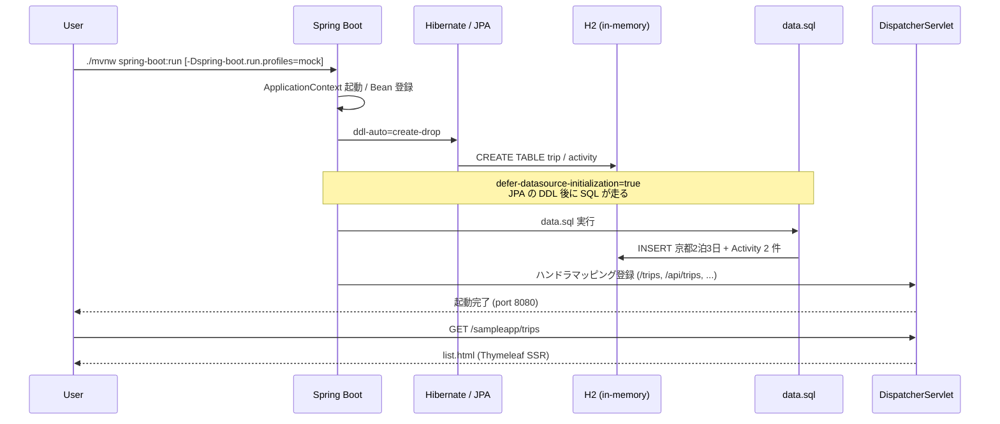

# セットアップ・起動方法

## 前提

| ツール  | バージョン                          |
| ------- | ----------------------------------- |
| Java    | 21（プロジェクトの `pom.xml` 準拠） |
| Node.js | 22.14.0 以上                        |
| npm     | 10.9.0 以上                         |

Maven は同梱の Maven Wrapper（`./mvnw`）を使うため、ローカルへの個別インストールは不要です。

## 起動方法 A: mock プロファイル（API キー不要・推奨）

ChatModel を **固定 JSON を返すスタブ Bean に差し替える** プロファイルです。OpenAI 互換エンドポイントへ接続せずに、AI 提案機能の挙動まで含めて UI / API を確認できます。

```bash
./mvnw spring-boot:run -Dspring-boot.run.profiles=mock
```

`AiConfig` 内で `@Profile("mock")` の `ChatModel` Bean が `@Primary` として登録されるため、`ItinerarySuggestionService` は実 LLM を呼び出さず、固定の `SuggestedActivity` を取得します。

## 起動方法 B: 実 LLM 接続

OpenAI 互換 API（OpenAI 本家、社内ホスト LLM ゲートウェイ等）へ接続する場合は、以下の環境変数を設定してから起動します。

| 環境変数                    | デフォルト               | 役割           |
| --------------------------- | ------------------------ | -------------- |
| `SPRING_AI_OPENAI_API_KEY`  | `dummy-key`              | API キー       |
| `SPRING_AI_OPENAI_BASE_URL` | `https://api.openai.com` | エンドポイント |
| `SPRING_AI_OPENAI_MODEL`    | `gpt-4o-mini`            | 使用モデル     |

```bash
export SPRING_AI_OPENAI_API_KEY=sk-xxxxxxxxxxxx
export SPRING_AI_OPENAI_BASE_URL=https://api.openai.com
export SPRING_AI_OPENAI_MODEL=gpt-4o-mini
./mvnw spring-boot:run
```

`mock` プロファイルを **指定しなければ** Spring AI の auto-configuration が標準 ChatModel を有効化します。

## アクセス URL

- 旅程一覧: `http://localhost:8080/sampleapp/trips`
- ルート: `http://localhost:8080/sampleapp/` （`/trips` へリダイレクト）
- Actuator (health): `http://localhost:8080/sampleapp/actuator/health`

## 起動シーケンス



## 開発時に便利なコマンド

| 用途                      | コマンド                   |
| ------------------------- | -------------------------- |
| Java テスト               | `./mvnw test`              |
| 静的解析 + テスト（fast） | `./mvnw -Pfast verify`     |
| カバレッジ閾値チェック    | `./mvnw -Pci-mr verify`    |
| `mvn site` レポート生成   | `./mvnw clean verify site` |
| JS テスト（vitest）       | `npm test`                 |
| JS ビルド（watch）        | `npm run build:watch`      |
| docusaurus ローカル起動   | `cd docs && npm start`     |

## 初期データ

起動時に `src/main/resources/data.sql` で 旅程 1 件 + Activity 2 件 が投入されます。
`spring.jpa.hibernate.ddl-auto=create-drop` のため、再起動するたびに DB はリセットされます。
