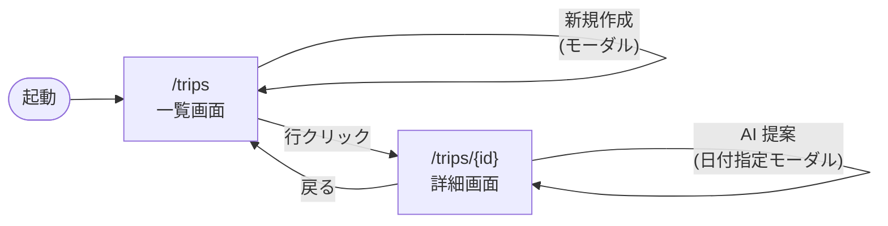

# 画面機能

サンプルアプリは Thymeleaf による 2 画面構成です。CRUD は Bootstrap モーダル + jQuery + AJAX で REST API を叩く形で実装されています。

## 画面構成

| パス              | テンプレート                  | 役割                                               |
| ----------------- | ----------------------------- | -------------------------------------------------- |
| `GET /`           | （リダイレクト）              | `/trips` へ                                        |
| `GET /trips`      | `templates/trips/list.html`   | 旅程一覧 + 新規作成モーダル                        |
| `GET /trips/{id}` | `templates/trips/detail.html` | 旅程詳細 + Activity 操作モーダル + AI 提案モーダル |

## 機能一覧

### 旅程一覧画面（`/trips`）

- 既存の Trip を表で表示（タイトル / 行先 / 期間 / Activity 件数）
- **新規作成** ボタン → モーダル（タイトル / 行先 / 開始日 / 終了日）→ `POST /api/trips`
- 行クリックで詳細画面へ遷移

### 旅程詳細画面（`/trips/{id}`）

- Trip ヘッダ表示
- **Trip 編集 / 削除**：モーダル → `PUT /api/trips/{id}` / `DELETE /api/trips/{id}`
- **Activity 一覧**：日付 / 時刻昇順
- **Activity 追加 / 編集 / 削除**：モーダル → `POST | PUT | DELETE /api/trips/{tripId}/activities[/{id}]`
- **AI 提案**：モーダルで日付を入力 → `POST /api/trips/{tripId}/ai/suggest-activities`
  - LLM が `WeatherTool`（モック天気 API）を呼び出し、structured output で 1 件の Activity を生成 → そのまま登録される

## 画面遷移図

## 入力バリデーション

| 項目                     | ルール                     | 検証箇所                              |
| ------------------------ | -------------------------- | ------------------------------------- |
| Trip.title               | 必須、100 文字以内         | アノテーション (`@Valid`)             |
| Trip.destination         | 必須、100 文字以内         | アノテーション (`@Valid`)             |
| Trip.startDate / endDate | 必須                       | アノテーション (`@Valid`)             |
| Trip 期間整合性          | `startDate <= endDate`     | Service（`IllegalArgumentException`） |
| Activity.date            | 必須、Trip 期間内          | アノテーション + Service              |
| Activity.title           | 必須、100 文字以内         | アノテーション (`@Valid`)             |
| Activity.location / note | 任意（100 / 500 文字以内） | アノテーション (`@Valid`)             |

API レベルのバリデーションエラーは 400 で `{ errors: [{field, message}] }` 形式、ドメインルール違反は 400 で `{ message }` 形式で返ります（[03-api-reference](./03-api-reference.md) 参照）。

## フロントエンド構成

`src/main/frontend/` 配下に Vite で束ねた最小の JS が置かれています。

| ファイル          | 役割                                        |
| ----------------- | ------------------------------------------- |
| `api-client.js`   | `fetch` ラッパ（CSRF / エラーハンドリング） |
| `modal-helper.js` | Bootstrap モーダル開閉 + フォーム値取得     |
| `trips-list.js`   | 一覧画面のイベント結線                      |
| `trips-detail.js` | 詳細画面 + AI 提案モーダルのイベント結線    |

ライブラリ（jQuery / Bootstrap）はすべて **webjar 経由**（`webjars-locator-core`）で参照しているため、`pom.xml` で完結し、ネット制約環境（npm 公式リポジトリ以外不可）でも動作します。
