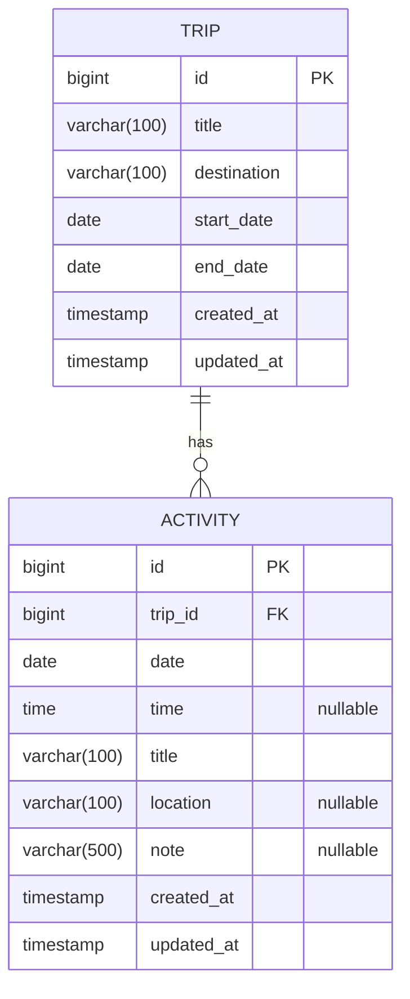
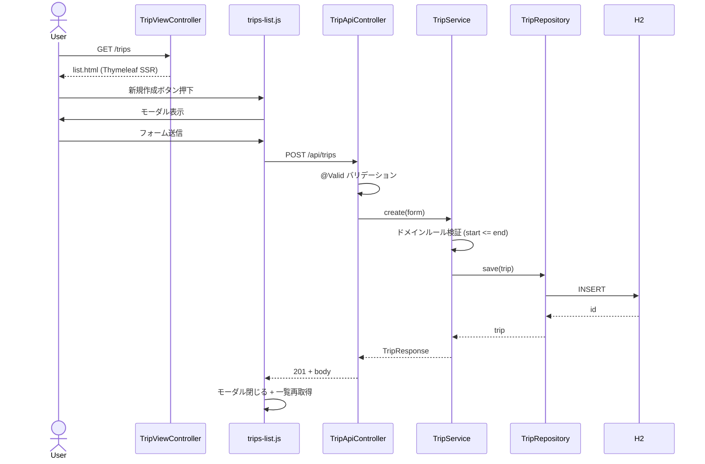
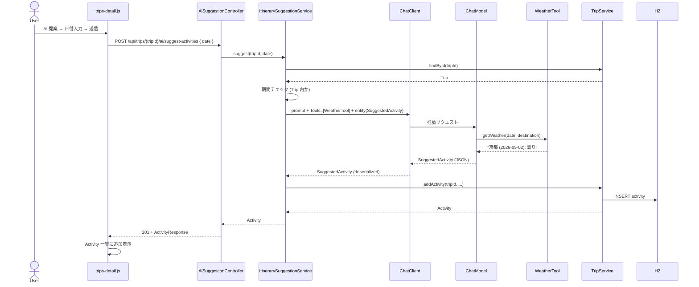

# アーキテクチャ

## レイヤ構成（トランザクションスクリプトパターン）

| レイヤ     | 責務                                                               |
| ---------- | ------------------------------------------------------------------ |
| Controller | HTTP 入出力 / `@Valid` バリデーション / DTO 変換                   |
| Service    | トランザクション境界（`@Transactional`）+ 手続き的ドメインロジック |
| Repository | Spring Data JPA（永続化のみ）                                      |
| Entity     | データ保持専用（JPA エンティティ）                                 |

ドメインロジックを Service に集約する素朴な構成にし、ボイラープレートとしての可読性を優先しています。

## パッケージ構成

```
src/main/java/sak/sample/
├── SampleApplication.java
├── itinerary/
│   ├── domain/                        … Trip, Activity
│   ├── repository/                    … TripRepository, ActivityRepository
│   ├── service/                       … TripService
│   ├── web/                           … TripViewController（Thymeleaf）
│   ├── api/                           … REST Controller + dto/
│   │   ├── TripApiController
│   │   ├── ActivityApiController
│   │   └── dto/                       … TripForm/Response, ActivityForm/Response
│   ├── ai/                            … itinerary の一機能としての AI サブパッケージ
│   │   ├── api/                       … AiSuggestionController
│   │   ├── service/                   … ItinerarySuggestionService
│   │   ├── tool/                      … WeatherTool（@Tool / モック）
│   │   ├── dto/                       … SuggestRequest, SuggestedActivity
│   │   ├── exception/                 … SuggestFailedException
│   │   └── config/                    … AiConfig（mock スタブ ChatModel）
│   └── exception/                     … TripNotFoundException, ActivityNotFoundException
└── common/
    ├── GlobalExceptionHandler.java    … @ControllerAdvice
    └── JpaConfig.java                 … JPA Auditing 有効化
```

## ドメインモデル（ER 図）



`Trip` から `Activity` へは `cascade=ALL` + `orphanRemoval=true` の `@OneToMany`。
監査列（`createdAt` / `updatedAt`）は Spring Data JPA の Auditing で自動採番されます。

## シーケンス: 旅程作成



## シーケンス: AI 提案（Tool + Structured Output）



> `mock` プロファイル時は `AiConfig#mockChatModel` が `@Primary` になり、`CM` は固定 JSON を返すスタブになります（`WeatherTool` は呼ばれません）。

## エラーハンドリング・観測性

- `GlobalExceptionHandler` で全例外を集約し、HTTP ステータスとレスポンス形式を統一
- `Micrometer Tracing (Brave)` により全リクエストへ `traceId` / `spanId` が付与され、ログパターン `%5p [${spring.application.name},%X{traceId},%X{spanId}]` で出力
- 502 / 500 のレスポンスには `traceId` を同梱し、ユーザがログ追跡できるようにしている

## 静的解析の最適化方針

- `lombok.config` で `lombok.addLombokGeneratedAnnotation = true` を有効化し、Lombok 生成メソッドを SpotBugs / JaCoCo の対象から自動除外
- JPA エンティティに対する `EI_EXPOSE_REP` / `EI_EXPOSE_REP2` は `rules/spotbugs/exclude.xml` で `itinerary.domain.*` のみ抑制
- PMD は `*Test.java` / `*.dto.*` / `*Form.java` に対して意図的にルールを除外（`rules/pmd/ruleset.xml` の `<exclude-pattern>`）
- JaCoCo の閾値（LINE 80% / BRANCH 70%）は `*.service.*` のみに適用（`itinerary.service` と `itinerary.ai.service` の両方を一括対象化）

ルール改定 vs 個別抑制の判断基準は `rules/README.md` を参照してください。
