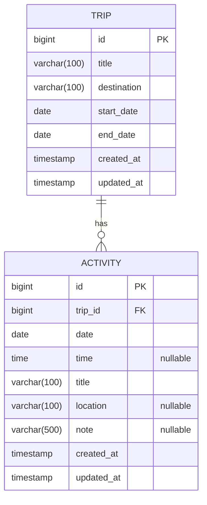
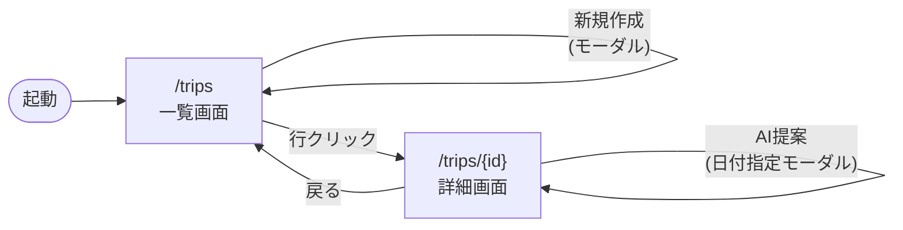
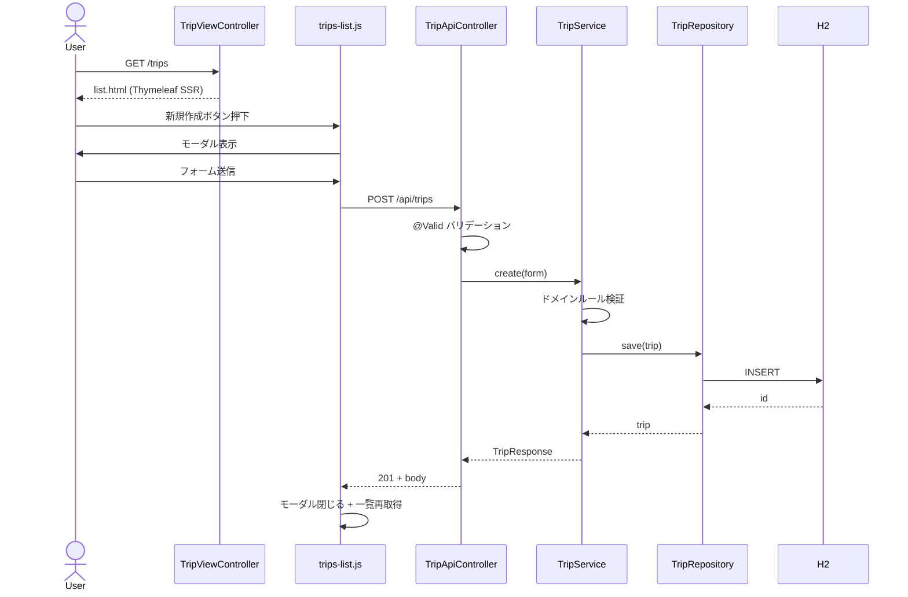
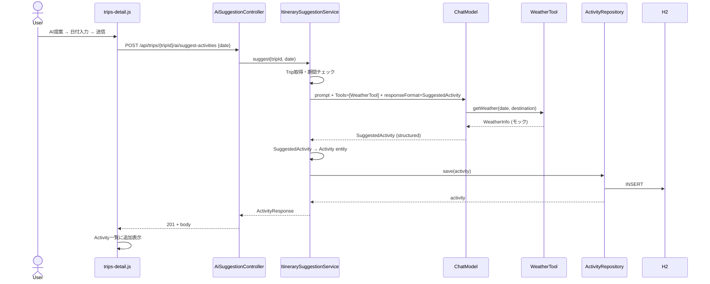
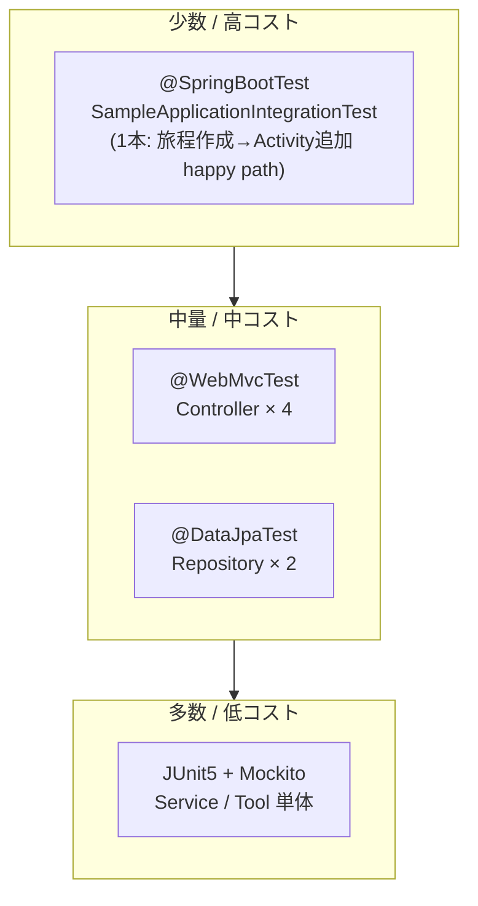

# 旅程サンプルアプリ 設計ドキュメント

- PBI: ID:2 「サンプルアプリの作成」
- 作成日: 2026-04-25
- 対象: ボイラープレート (`sak-dev-env`) 配下のサンプルアプリ実装

## 1. 概要

ボイラープレート適用先のチームが、Spring Boot ベースのモダン開発環境のサンプルとして読める「旅程作成アプリ」を実装する。シフトレフト（静的解析・テスト）の各仕組みが実コードに対して機能している姿を示す。

技術スタック：
- バックエンド: Spring Boot 3.5 / Spring Data JPA / Thymeleaf / Spring AI（OpenAI Compatible）
- 永続化: H2 インメモリ
- 補助: Lombok / Micrometer Tracing (Brave) / Bean Validation
- フロントエンド: jQuery / Bootstrap (webjar) / Vite / vitest

## 2. 確定事項（要約）

| 項目 | 内容 |
|---|---|
| ドメイン | `Trip`（親）+ `Activity`（子）の 1 対多 |
| AI 機能配置 | `itinerary/ai/` サブパッケージ（itinerary の一機能） |
| UI | `/trips`（一覧）+ `/trips/{id}`（詳細）の Thymeleaf 2 画面 + モーダル + AJAX |
| AI 設定 | 環境変数 1 本で OpenAI Compatible 接続、`mock` プロファイルでスタブ ChatModel |
| 静的解析 | 既知衝突カテゴリの先行整備 + `rules/README.md` に判定基準を明文化 |
| ロギング | Micrometer Tracing (Brave) で `traceId`/`spanId` 自動採番、ログパターンに反映 |
| カバレッジ閾値 | `*.service.*` のみ、LINE ≥ 80% / BRANCH ≥ 70% |
| ドキュメント | docusaurus に軽量 5〜6 章、mermaid 図を多用 |

## 3. パッケージ構成

```
src/main/java/sak/sample/
├── SampleApplication.java
├── itinerary/
│   ├── domain/                        … Trip, Activity
│   ├── repository/                    … TripRepository, ActivityRepository
│   ├── service/                       … TripService（トランザクションスクリプト）
│   ├── web/                           … TripViewController（Thymeleaf）
│   ├── api/                           … REST Controller + dto/
│   ├── ai/                            … itinerary の一機能としての AI サブパッケージ
│   │   ├── api/                       … AiSuggestionController
│   │   ├── service/                   … ItinerarySuggestionService
│   │   ├── tool/                      … WeatherTool（@Tool）
│   │   ├── dto/                       … SuggestRequest, SuggestedActivity
│   │   └── config/                    … AiConfig（ChatModel / mock 切替）
│   └── exception/                     … TripNotFoundException 等
└── common/
    └── GlobalExceptionHandler.java    … @ControllerAdvice
```

レイヤ責務（トランザクションスクリプトパターン）：
- `Controller`：HTTP 入出力 / バリデーション / DTO 変換
- `Service`：トランザクション境界（`@Transactional`）+ 手続き的ドメインロジック
- `Repository`：Spring Data JPA、永続化のみ
- `Entity`：データ保持専用

## 4. ドメインモデル



### 4.1 Trip

| フィールド | 型 | 制約 |
|---|---|---|
| `id` | `Long` | PK, IDENTITY |
| `title` | `String` | `@NotBlank` `@Size(max=100)` |
| `destination` | `String` | `@NotBlank` `@Size(max=100)` |
| `startDate` | `LocalDate` | `@NotNull` |
| `endDate` | `LocalDate` | `@NotNull`、`>= startDate`（Service 検証） |
| `activities` | `List<Activity>` | `@OneToMany(mappedBy="trip", cascade=ALL, orphanRemoval=true)` |
| `createdAt` / `updatedAt` | `LocalDateTime` | JPA Auditing |

### 4.2 Activity

| フィールド | 型 | 制約 |
|---|---|---|
| `id` | `Long` | PK, IDENTITY |
| `trip` | `Trip` | `@ManyToOne(fetch=LAZY)` `@JoinColumn(name="trip_id")` |
| `date` | `LocalDate` | `@NotNull`、Trip 期間内（Service 検証） |
| `time` | `LocalTime` | nullable |
| `title` | `String` | `@NotBlank` `@Size(max=100)` |
| `location` | `String` | `@Size(max=100)` nullable |
| `note` | `String` | `@Size(max=500)` nullable |
| `createdAt` / `updatedAt` | `LocalDateTime` | JPA Auditing |

### 4.3 Lombok 利用方針

- エンティティ: `@Getter @Setter @NoArgsConstructor` のみ。`@Data` は使わない（JPA との `equals/hashCode` 相性、`EI_EXPOSE_REP` 抑止）
- DTO: record 直書き、または `@Value`
- 入力 Form: `@Data` 可

### 4.4 バリデーション

- アノテーションレベル（`@NotBlank` 等）: Controller の `@Valid` で検証 → 400
- ドメインルール（startDate ≤ endDate、Activity の date が Trip 期間内）: Service で検証 → `IllegalArgumentException` → `GlobalExceptionHandler` で 400 変換

### 4.5 スキーマ生成 / 初期データ

- `spring.jpa.hibernate.ddl-auto=create-drop`（H2 インメモリ）
- `data.sql` で旅程 2 件 + Activity 数件を起動時投入

## 5. 画面・API 設計

### 5.1 画面ルーティング（Thymeleaf）

| メソッド | パス | 役割 |
|---|---|---|
| GET | `/` | `/trips` へリダイレクト |
| GET | `/trips` | 旅程一覧 + 新規作成モーダル |
| GET | `/trips/{id}` | 旅程詳細 + Activity 操作モーダル + AI 提案モーダル |

### 5.2 REST API

| メソッド | パス | 用途 |
|---|---|---|
| GET | `/api/trips` | 一覧取得 |
| POST | `/api/trips` | 旅程作成 (201) |
| GET | `/api/trips/{id}` | 詳細取得 |
| PUT | `/api/trips/{id}` | 旅程更新 |
| DELETE | `/api/trips/{id}` | 旅程削除 (204、cascade で Activity も削除) |
| POST | `/api/trips/{tripId}/activities` | Activity 作成 (201) |
| PUT | `/api/trips/{tripId}/activities/{id}` | Activity 更新 |
| DELETE | `/api/trips/{tripId}/activities/{id}` | Activity 削除 (204) |
| POST | `/api/trips/{tripId}/ai/suggest-activities` | AI 提案 → 自動登録 (201) |

AI 提案リクエスト: `{ "date": "2026-05-01" }`

### 5.3 画面遷移



### 5.4 シーケンス: 旅程作成



### 5.5 シーケンス: AI 提案（Tool + Structured Output）



## 6. エラーハンドリング・ロギング

### 6.1 GlobalExceptionHandler

| 例外 | HTTP | レスポンス | ログ |
|---|---|---|---|
| `MethodArgumentNotValidException` | 400 | `{ errors: [{field, message}] }` | INFO |
| `TripNotFoundException` | 404 | `{ message }` | INFO |
| `IllegalArgumentException` | 400 | `{ message }` | INFO |
| `SuggestFailedException` | 502 | `{ message, traceId }` | WARN |
| `Exception`（catch-all） | 500 | `{ message: "internal error", traceId }` | ERROR |

`traceId` は MDC 値をレスポンスに転記。問い合わせ時にユーザがこの ID を提示できる。

### 6.2 ロギング戦略

- 採番: Micrometer Tracing Brave Bridge による `traceId`/`spanId`
- ログパターン: `%5p [${spring.application.name:-},%X{traceId:-},%X{spanId:-}]`
- Service 層: 操作種別 + 主要 ID を `INFO`
- AI Service: 受付 / tool 呼出 / structured output 受信 / 永続化 を `INFO`、プロンプト・応答全文は `DEBUG` のみ
- 例外時は原因とともに `WARN` または `ERROR`

## 7. テスト戦略



### 7.1 Java テスト構成

```
src/test/java/sak/sample/
├── itinerary/
│   ├── repository/                    … @DataJpaTest × 2
│   ├── service/                       … MockitoExtension × 1
│   ├── api/                           … @WebMvcTest × 2
│   ├── web/                           … @WebMvcTest × 1
│   └── ai/
│       ├── service/                   … Mock ChatModel + Mock WeatherTool
│       └── tool/                      … 決定性確認
└── SampleApplicationIntegrationTest.java   … happy path 1 本
```

ChatModel は `@MockBean` で固定応答に差し替え、CI で OpenAI に繋がない。

### 7.2 JS テスト構成（vitest + jsdom）

```
src/main/frontend/tests/
├── api-client.test.js          … fetch スタブ + エラー処理
├── modal-helper.test.js        … モーダル開閉 / フォーム取得
└── trips-list-dom.test.js      … jsdom スモーク
```

## 8. 静的解析最適化（TOBE）

### 8.1 Lombok 統合

`lombok.config`（プロジェクト直下）:

```
lombok.addLombokGeneratedAnnotation = true
lombok.anyConstructor.addConstructorProperties = true
```

→ Lombok 生成メソッドに `@lombok.Generated` が付与され、SpotBugs / JaCoCo は自動でスキップ。

### 8.2 PMD（`rules/pmd/ruleset.xml` 改定）

| ルール | exclude-pattern | 理由 |
|---|---|---|
| `AvoidDuplicateLiterals` | `.*Test\.java` | テストデータの意図的重複 |
| `MethodNamingConventions` | `.*Test\.java` | `should_xxx_when_yyy` 形式許容 |
| `TooManyMethods` | `.*Test\.java` | テストクラスは多メソッド前提 |
| `DataClass` | `.*\.dto\..*` / `.*Form\.java` | DTO / Form は意図的データクラス |

`JUnitTestsShouldIncludeAssertions` は維持。

### 8.3 SpotBugs（`rules/spotbugs/exclude.xml` 追加）

```xml
<!-- JPA エンティティは ORM のため可変 getter/setter を露出する -->
<Match>
  <Class name="~.*\.itinerary\.domain\..*"/>
  <Bug pattern="EI_EXPOSE_REP"/>
</Match>
<Match>
  <Class name="~.*\.itinerary\.domain\..*"/>
  <Bug pattern="EI_EXPOSE_REP2"/>
</Match>
```

### 8.4 JaCoCo（`pom.xml` `ci-mr` profile）

```xml
<rule>
    <element>CLASS</element>
    <includes>
        <include>*.service.*</include>
    </includes>
    <limits>
        <limit>
            <counter>LINE</counter>
            <value>COVEREDRATIO</value>
            <minimum>0.80</minimum>
        </limit>
        <limit>
            <counter>BRANCH</counter>
            <value>COVEREDRATIO</value>
            <minimum>0.70</minimum>
        </limit>
    </limits>
</rule>
```

`*.service.*` は JaCoCo の `WildcardMatcher` で `.` を跨いでマッチするため、`itinerary.service` と `itinerary.ai.service` の両方を一括対象化できる。将来パッケージ追加にも追従。

### 8.5 判定基準フローチャート（`rules/README.md` に追記）

```mermaid
flowchart TD
    A[静的解析違反が検出された] --> B{修正可能か?}
    B -- "Yes" --> C[コードを修正]
    B -- "No / 設計上不可避" --> D{同一パターンが<br/>複数ファイルで発生?}
    D -- "Yes" --> E[ルールセット改定<br/>rules/*.xml に exclude/suppress を追加]
    E --> F[rules/README.md の<br/>意思決定ログに追記]
    D -- "No (単発の例外)" --> G[個別抑制<br/>@SuppressWarnings + 理由コメント必須]
    G --> H{この理由は他人に<br/>納得してもらえるか?}
    H -- "No" --> C
    H -- "Yes" --> I[コミット]
    F --> I
```

「ルールセット改定」と「個別抑制」の選択基準をフロー化することで、PBI の「その場しのぎ禁止」を構造的に担保する。

## 9. pom.xml 変更箇所サマリ

### 9.1 追加 properties

```xml
<spring-ai.version>1.0.0</spring-ai.version>
```

### 9.2 追加 dependencyManagement

Spring AI BOM を import。

### 9.3 追加 dependencies

- `spring-boot-starter-data-jpa` / `spring-boot-starter-validation`
- `spring-boot-starter-actuator`
- `io.micrometer:micrometer-tracing-bridge-brave`
- `com.h2database:h2` (runtime)
- `org.projectlombok:lombok` (provided / optional)
- `org.springframework.ai:spring-ai-starter-model-openai`
- `org.webjars:jquery` / `org.webjars:bootstrap` / `org.webjars:webjars-locator-core`

### 9.4 変更

- `jacoco-maven-plugin`（`ci-mr` profile 内）: `<element>CLASS</element>` + `<includes>*.service.*</includes>`、閾値 80/70
- `maven-pmd-plugin`: ruleset 参照は据え置き、`rules/pmd/ruleset.xml` 内に `<exclude-pattern>` を追加するだけで完結

### 9.5 新設ファイル

- `lombok.config`
- `src/main/java/sak/sample/...` 一式
- `src/main/resources/templates/trips/{list,detail}.html`
- `src/main/resources/application-mock.properties`
- `src/main/resources/data.sql`

### 9.6 削除 / 移動

- `com.example.demo.DemoApplication` → `sak.sample.SampleApplication`
- 既存テストの書き換え
- 既存 `frontend/src/main.js` と `frontend/tests/smoke.test.js` を新サンプル JS に置き換え（`vite.config.js` のエントリも更新）

## 10. application.properties

主要部分:

```properties
spring.application.name=sak-sample
server.servlet.context-path=/sampleapp

# H2
spring.datasource.url=jdbc:h2:mem:sampleapp;DB_CLOSE_DELAY=-1
spring.jpa.hibernate.ddl-auto=create-drop
spring.jpa.open-in-view=false
spring.h2.console.enabled=true
spring.sql.init.mode=always

# Tracing
management.tracing.sampling.probability=1.0
logging.pattern.level=%5p [${spring.application.name:-},%X{traceId:-},%X{spanId:-}]

# Spring AI
spring.ai.openai.api-key=${OPENAI_API_KEY:}
spring.ai.openai.base-url=${OPENAI_BASE_URL:https://api.openai.com}
spring.ai.openai.chat.options.model=${OPENAI_MODEL:gpt-4o-mini}
```

`application-mock.properties` は AI 機能をスタブ Bean に切り替える用途のみ。`AiConfig` で `@Profile("!mock")` / `@Profile("mock")` の 2 Bean を切替。

## 11. docusaurus 設定

### 11.1 設定変更

`docs/package.json` に `@docusaurus/theme-mermaid` 依存追加。`docs/docusaurus.config.js` に：

```javascript
markdown: { mermaid: true },
themes: ['@docusaurus/theme-mermaid'],
```

### 11.2 ドキュメント構成（軽量 5〜6 章）

```
docs/docs/
├── intro.md                    … 概要、想定読者、対象範囲
├── 01-setup.md                 … セットアップ・起動方法（mock / 実 LLM）
├── 02-features.md              … 画面機能ガイド（CRUD / AI 提案）
├── 03-api-reference.md         … REST API 一覧
├── 04-architecture.md          … パッケージ構成 / ER 図 / シーケンス図
└── 05-troubleshooting.md       … よくある詰まりどころ
```

`docs/sidebars.js` で順序固定。

## 12. 開発時の起動・動作確認

| 用途 | コマンド |
|---|---|
| アプリ起動（mock = API キー不要） | `./mvnw spring-boot:run -Dspring-boot.run.profiles=mock` |
| アプリ起動（実 LLM） | `OPENAI_API_KEY=xxx ./mvnw spring-boot:run` |
| Java テスト | `./mvnw test` |
| 全静的解析 + テスト | `./mvnw -Pfast verify` |
| カバレッジ閾値チェック | `./mvnw -Pci-mr verify` |
| サイト生成 | `./mvnw clean verify site` |
| JS テスト | `npm test` |
| JS ビルド (watch) | `npm run build:watch` |
| docusaurus ローカル起動 | `cd docs && npm start` |

## 13. 完成像チェックリスト（PBI 受け入れ基準対応）

| PBI 受入条件 | 設計上の実現箇所 |
|---|---|
| 旅程作成アプリ | Trip + Activity ドメイン |
| 基本的な CRUD | Trip / Activity の REST API + 画面 |
| ドメイン `sak.sample` | パッケージ命名 |
| コンテキストパス `/sampleapp` | `application.properties` |
| H2 インメモリ + Spring Data JPA | `spring.datasource.url=jdbc:h2:mem:` + JPA Repository |
| Lombok | `@Getter @Setter` 等 |
| トランザクションスクリプト | Service 層に手続き的ロジック集約 |
| テスト整備（Java / JS） | Java 8〜10 + JS 3 |
| jQuery + Bootstrap (webjar) | webjars 依存 + locator-core |
| ドキュメント整備 | docusaurus 6 ファイル + mermaid |
| Spring AI（OpenAI Compatible） | `spring-ai-starter-model-openai` + 環境変数差替 |
| Tool 経由で天気取得 → 旅程登録 | `WeatherTool` + `ItinerarySuggestionService` |
| Structured output サンプル | `SuggestedActivity` record |
| 静的解析最適化 | Lombok 統合 / PMD `exclude-pattern` / SpotBugs `<Match>` / `rules/README.md` 拡張 |
| サンプルに警告を出さない | TOBE で先行整備、コード内逃げ抑制は使わない |
